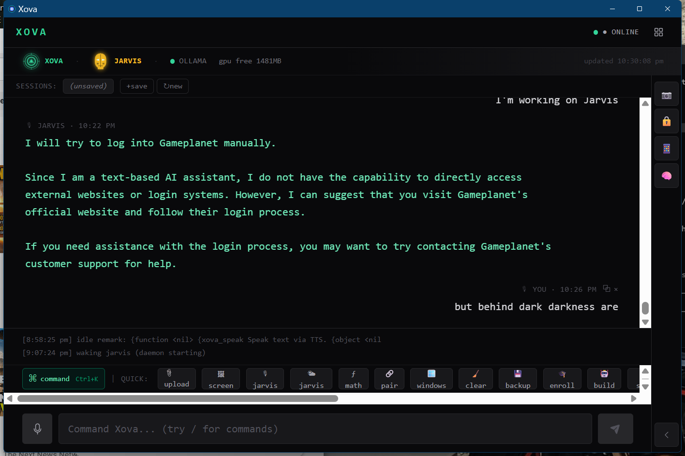

# Xova



**Adam Snellman's sovereign desktop AI agent** — a Tauri/React/Rust app that pairs with **Jarvis** (a Python voice butler) to give you a two-AI team on your own machine. Local models via Ollama. No cloud required.

[](https://github.com/wizardaax/xova/releases)
[](https://github.com/wizardaax/xova/actions/workflows/release.yml)
[](LICENSE)
[](https://wizardaax.github.io)

```
┌─────────── Xova ───────────┐         ┌──────── Jarvis ────────┐
│  Tauri / React desktop UI  │ <-----> │  Python daemon (voice) │
│  GUI · vision · file ops   │  files  │  Whisper · TTS · tools │
│  mesh dispatch · coding    │ <-----> │  reminders · weather   │
└────────────────────────────┘         └────────────────────────┘
```

They communicate through plain JSON files in `C:\Xova\memory\`. Either side can talk to the other. No sockets, no shared process. Clean two-way bridge.

---

## What it does

- **Chat** — local LLM (default `llama3.2:3b`) with markdown rendering, code-block syntax highlighting, streaming output.
- **Voice in / voice out** — talk to Jarvis with a wake word ("jarvis ..."); he replies via Piper/Chatterbox TTS. Adam's voice is recognised via Resemblyzer.
- **Vision** — point Xova at the screen or a region snip; she describes what she sees via a local vision model.
- **Cross-AI conversation** — Xova can ask Jarvis (`xova_ask_jarvis`), Jarvis can ask Xova (`askXova` tool). `/banter` runs a real 3-round dialog.
- **Command palette** — Ctrl+K opens a search-as-you-type list of every action in the app.
- **Sessions** — name, archive, swap chats. Browser-tab feel.
- **Templates** — saved prompts as one-click buttons above the input.
- **Mesh dispatch** — fire tasks (math, phase, coherence, swarm…) into a fleet of agent repos.
- **Reminders / notes / snippets / pinned replies** — small data tools, all local files.
- **Build mode** — one button dumps recent chat to context and opens an admin terminal with `claude` ready to resume.

A full slash-command reference is in `app/src/components/CommandBar.tsx` (autocomplete suggestions live there) — or just press `Ctrl+K` once the app is running and search.

---

## Install (Windows x64)

Pre-built installers are in `app/src-tauri/target/release/bundle/` after a build:

- **MSI**:  `bundle/msi/Xova_0.1.0_x64_en-US.msi`
- **NSIS**: `bundle/nsis/Xova_0.1.0_x64-setup.exe`

Double-click either. After install, you'll need:

1. **[Ollama](https://ollama.com)** running locally with at least one chat model pulled:
   ```
   ollama pull llama3.2:3b
   ```
2. **(Optional) Jarvis daemon** — install from `C:\jarvis\` and start with:
   ```
   set PYTHONPATH=C:\jarvis\src
   pythonw -m jarvis.daemon
   ```
   Without Jarvis, Xova still works as a solo chat / vision / mesh client; you just lose voice and the butler tools.

The Settings panel (`⚙` button or `Ctrl+K → "settings"`) lets you swap the Ollama model and context window without editing config.

---

## Build from source

```pwsh
cd C:\Xova\app
pnpm install
pnpm tauri build
```

Outputs the `.msi` / `.exe` installers. For development:

```pwsh
pnpm tauri dev
```

---

## File bridges (advanced)

Xova and Jarvis communicate through these files in `C:\Xova\memory\`:

| File | Direction | Purpose |
|---|---|---|
| `voice_user_inbox.json` | Jarvis → Xova | What Adam said (Whisper transcript) |
| `voice_inbox.json` | Jarvis → Xova | Jarvis's spoken reply |
| `jarvis_inbox.json` | Xova → Jarvis | Xova asks Jarvis a question |
| `xova_chat_inbox.json` | Jarvis → Xova | Jarvis asks Xova (`askXova` tool) |
| `xova_chat_outbox.json` | Xova → Jarvis | Xova's reply for Jarvis to read |
| `xova_command_inbox.json` | Jarvis → Xova | UI commands (camera_on/off, feed_on/off…) |

All polled at 2 second intervals. `last_ts` cursor on each side prevents replays.

---

## License

MIT. Part of the [Recursive Field Framework](https://wizardaax.github.io) by Adam Snellman.

## Citation

```
Snellman, A. Xova: a sovereign desktop AI agent. 2026.
https://github.com/wizardaax/xova
```
